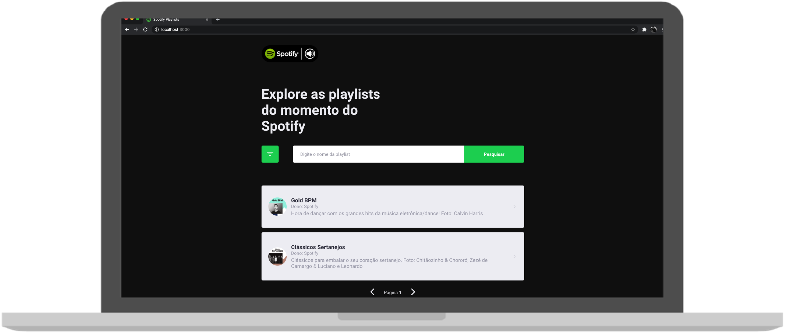
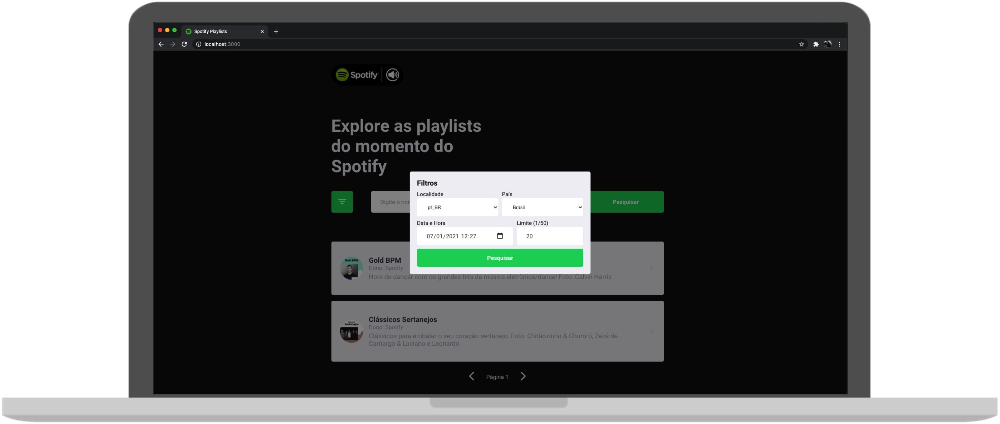

## 🎬 Preview

<br />


## 🔖 INSTRUCTIONS

- To use the Spotify API, please paste your access token into REACT_APP_SPOTIFY_TOKEN at the .env file

#### Cloning the project and installing its dependencies
```sh
git clone https://github.com/Ribas187/react-test.git
cd react-test
cd spotify-playlists-web
yarn
```
#### Paste your access token at the .env file
#### Starting the project
```sh
yarn start
```
---

## :memo: Guilherme Ribas
Feito com ♥ by Guilherme Ribas :wave:
