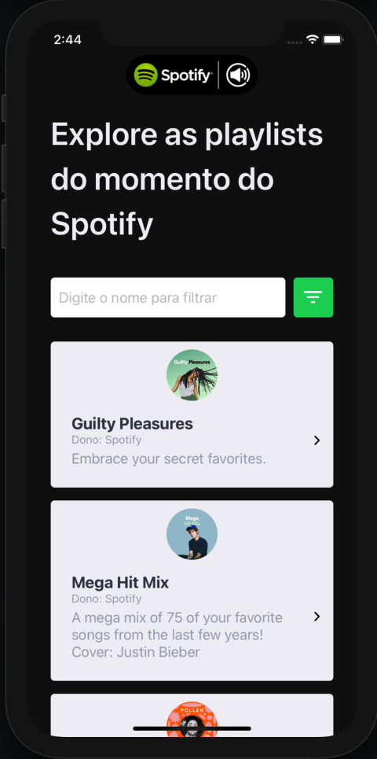
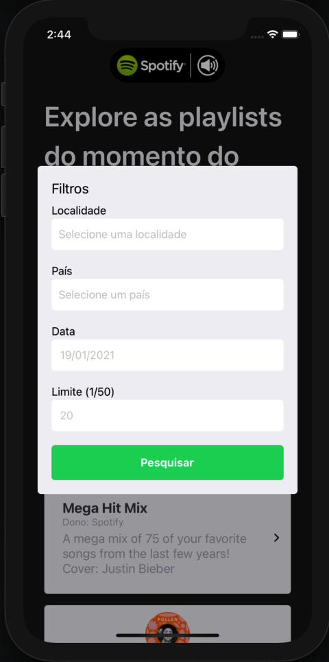

## 🎬 Preview



## 🔖 Como Executar
#### Clonando o projeto e instalando as dependências
```sh
git clone https://github.com/Ribas187/react-test.git
cd spotifyPlaylistsMobile
yarn
```
#### Rodando projeto no Android
```sh
yarn android
```
#### Rodando projeto no iOS
```sh
npx pod-install ios
yarn ios
```

---
## :memo: Guilherme Ribas
Feito com ♥ by Guilherme Ribas :wave:
